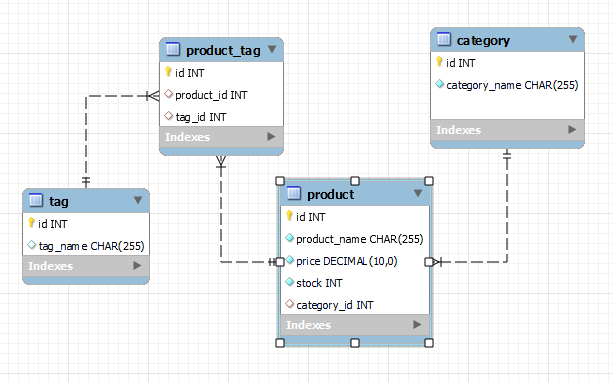
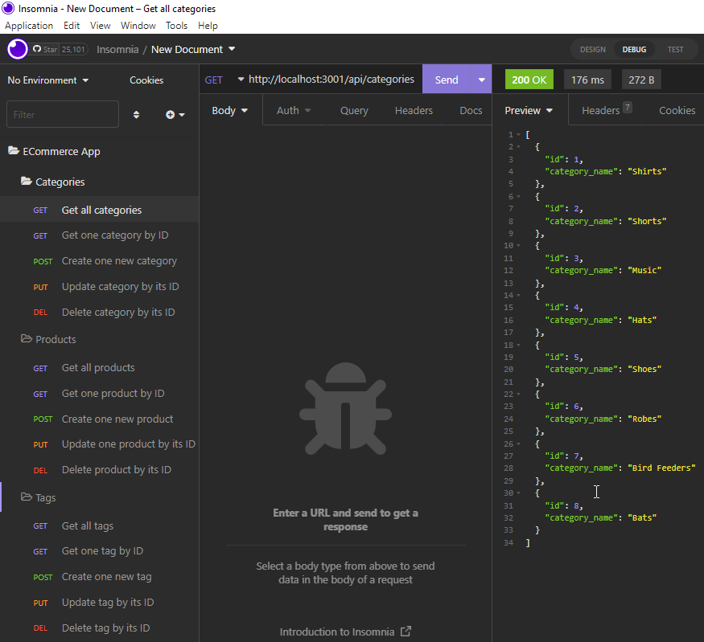

# 13 - Ecommerce Backend Using Express Routes and Sequelize ORM
# Submitted by Conor Donnelly - December 1, 2022

> Internet retail, also known as e-commerce, is the largest sector of the electronics industry, having generated an estimated US$29  trillion in 2017 (Source: United Nations Conference on Trade and Development).
>

This challenge required us to use provided starter code to build out a functioning back end for an ecommerce website. A data model was defined containing several tables:

* Category
* Products
* Tag
* ProductTag

First, put database credentials into a .env file to keep them secure and and separated from the code. Make sure .env files are listed in .gitignore so they won't be sent to GitHub.

Then edit schema.sql to provide instructions to create a new empty database called "ecommerce_db"

Then I added these table definitions to .js files in the models folder. Defining the model for use by Sequelize allows us to create the tables and populate them with provided sample data by running "npm run seed" script.

Once the database is created and seeded I moved on to creating the Express routes used by the REST api. Starter code lists out the areas that need our attention. I created routes using Sequelize module syntax for CRUD operations on each table.

Finally, I used Insomnia to test these newly created routes and make sure that the database is being updated by the HTTP reqests as expected.

Click link below to see a screenrecording demo of the working application!

https://drive.google.com/file/d/xxxxxxxxxxxxxxxxxxxxxxxxxx/view

## Screenshot 1

## Screenshot 2
